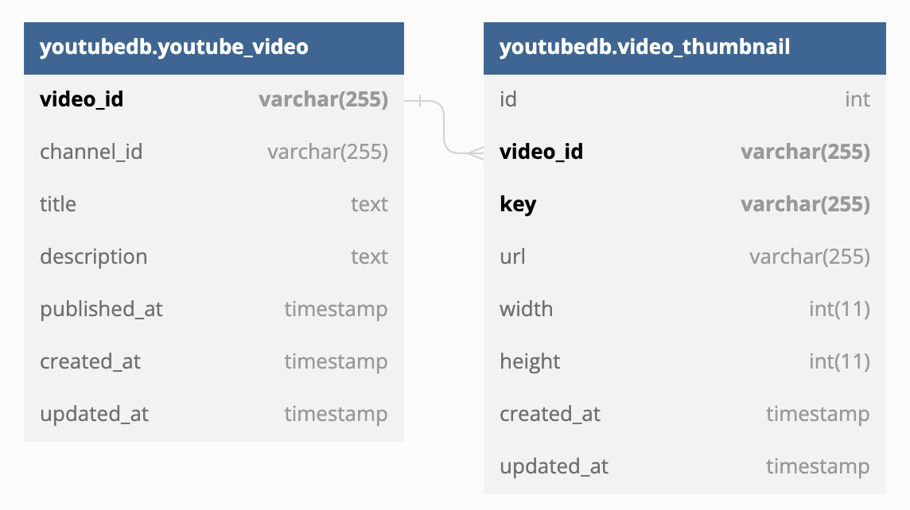
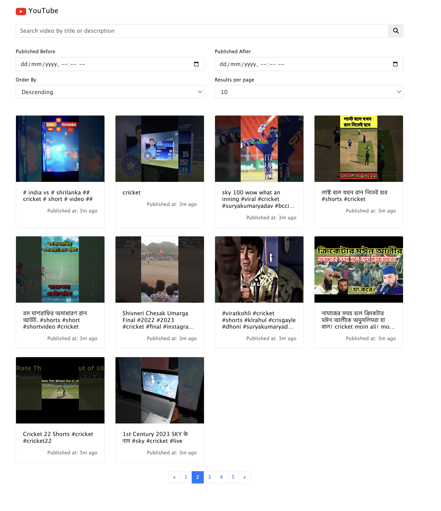

## Backend Assignment | FamPay
Author: [Shubham Panchal](https://www.linkedin.com/in/shubham-panchal-18bb6b187/)  
Kickoff Date: `Jan 06, 2023`  
Deadline: < 48hrs  

### Project Goal
To make an API to fetch latest videos sorted in reverse chronological order of their publishing date-time from YouTube for a given tag/search query in a paginated response.    
For more details visit [here](https://www.notion.so/fampay/Backend-Assignment-FamPay-32aa100dbd8a4479878f174ad8f9d990)  

### Deliverables  
The deliverables/source-code of the assinment is available at [github.com/panchalshubham0608/FamPayAssignment](https://github.com/panchalshubham0608/FamPayAssignment). A quick demo of the working application is avaialble [here](https://drive.google.com/file/d/1F_qBrkROhUkb4DxEUhP9-pIIACqoVp2H/view?usp=sharing).
Here are quick details related to technical stack:
- [Node.js](https://nodejs.org/en/): Open-source, cross-platform JavaScript runtime environment  
- [Express.js](https://expressjs.com/): Fast, unopinionated, minimalist web framework for Node.js  
- [MySQL](https://www.mysql.com/): Database used for storing data. The database used in this assignment is hosted on azure.  
- [Bootstrap](https://getbootstrap.com/): Powerful, extensible, and feature-packed frontend toolkit for styling dashboard.  

The application is configured to write logs to `logs/error.log` and `logs/combined.log` which are helpful to debug the application.  


### Database Schema
The following ERD shows the database schema  
  

### Endpoints 
The following is the REST API endpoint which can be used to retrieve the data from the server:   
```
GET /api
```
The following are the supported query parameters
| Query Parameter | Description |
| -- | -- |
| `search` | search query to search by `title` or `description` |
| `order` | order in which contents are to be retrieved - `ASC` or `DESC` |
| `limit` | limit the number of entries to be returned |
| `page` | page number to be retrieved |
| `publishedAfter` | to retrieve entries published after given date |
| `publishedBefore` | to retrieve entries published before given date |

The following is the client-facing endpoint which can be used to browse the list of videos on UI  
```
GET /
```
The following screenshot shows a sample output



## How to run 
The application is containerized with docker. Before we start the application make sure we have appropriate environment variables configured:  
```bash
export DB_NAME=youtubedb
export DB_USER=<username>
export DB_PASSWORD=<password>
export YOUTUBE_API_KEYS=<key1,key2,...,keyN>
```

To start the application run the below commands:  
```bash
$ docker-compose build
$ docker-compose up
```
You should be able to browse the application at http://localhost:8080/

**NOTE**: In case if you encounter a db-connection error then following the below steps to create a new user. Make sure that your container is running with above commands. Open a fresh new terminal and run `docker ps`
```bash
$ docker ps
CONTAINER ID   IMAGE       COMMAND                  CREATED          STATUS                           PORTS                               NAMES
2209299c7fff   mysql:5.7   "docker-entrypoint.s…"   25 minutes ago   Up 1 second (health: starting)   0.0.0.0:3306->3306/tcp, 33060/tcp   mysqldb
```
As shown in the above example you will get a process similar to above. Note the id of this container and proceed to next step.
```
$ docker exec -it 2209299c7fff bash
bash-4.2# mysql
mysql> CREATE USER 'username'@'%' IDENTIFIED BY 'password';
mysql> GRANT ALL ON *.* TO 'username'@'%';
mysql> exit;
bash-4.2# exit
```
Now you can shutdown the `docker-compose up` and re-execute and that should fix the error.  


## More technical details  
**What's the strategy to sync database with latest videos?**  
We retrieve the last `published_at` from the database and then make an API call to [YouTube Data API](https://developers.google.com/youtube/v3/getting-started) to retrieve all videos that were published after this timestamp. Note that when we run the application for the first time there are no entries in database and in that case we use a default value of `Jan 01, 2023`.  

**Did we consider the paginated response from YouTube Data API?**  
Yes! When we make a call to search videos with YouTube Data API [search endpoint](https://developers.google.com/youtube/v3/docs/search/list) we get a response of the following form:  
```json
{
  "kind": "youtube#searchListResponse",
  "etag": etag,
  "nextPageToken": string,
  "prevPageToken": string,
  "regionCode": string,
  "pageInfo": {
    "totalResults": integer,
    "resultsPerPage": integer
  },
  "items": [
    search Resource
  ]
}
```   
Here we get a max of 50 results per API call and if there are more results then that can be retrieved using the `nextPageToken`. Keeping that in mind, a loop is written to continue reading the data as long as there is a next page and then repeat this process every `10s`.  

**How are we inserting the videos into the database?**  
We are making batch insertion where we batch the videos retrieved in one API call together into a single `INSERT` query for performance. This indicates that at-max 50 `INSERT` statements are batched into a single statement. This batching process can further be fine-tuned to boost performance and is therefore scalabale approach for data-insertion.

**How did we handle the duplicate entries?**  
To avoid inserting duplicate entries into the database we first collected the video-ids and then made a single query against database to filter out those ids which are present in the database. Now we have the list of ids that are not present and are to be inserted into the database.  

**Did we handle the edge case where title/description may contain special unicode characters say emojis/chinese/etc?**  
This scenario is NOT explicitly covered in this assignment however potential solutions are proposed. For example we can encode our data before inserting it into the database or allow multi-byte characters into our database. For sake of ease we haven't covered it though!  

**Do we allow multiple API Keys? (BONUS)**  
_YES!_ By nature of the application, it's difficult to develop/maintain it without this feature. We allow multiple API keys to be supplied via environment variables e.g. `YOUTUBE_API_KEYS=key1,key2,key3,...,keyN` and use the keys in `round-robin` fashion. If `key1` has exhausted the quota we will switch to using `key2` and then `key3` and so on. 

**Do we have a dashboard where we can visualize the results?(BONUS)**  
For ease of testing a dashboard is available at `/`([http://localhost:8080/](http://localhost:8080/)) endpoint which shows `paginated` responses retrieved from the endpoint browsing contents from database. This offers you the capability of `searching`, `sorting`, `filtering`, etc. 

**Did we optimise the search API to handle partial matches?(BONUS)**  
_NO_. This could have been done by tweaking the process of querying the database but that is extremely _ineffecient_ and is therefore avoided. As we sync the data in the background our data will keep growing and after a certain point of time our search queries will become slow. For these use-cases we have `Elasticsearch`. We can index our data into Elasticsearch with `ngrams` and then searching can be a two step process where in the first step we will retrieve the video-ids that matches with given search query and then retrieve the full data corresponding to the matched videos-ids. The use of elastic-search will not only allow us with partial-matching indeed it has more powerful capabilities such as fuzzy-search.  

**Is our application containerized?**  
The application is fully containerized with `docker`.  


### Queries?
In case if you have any queries then please feel free to reach me at **shubhampanchal9773@gmail.com**  
